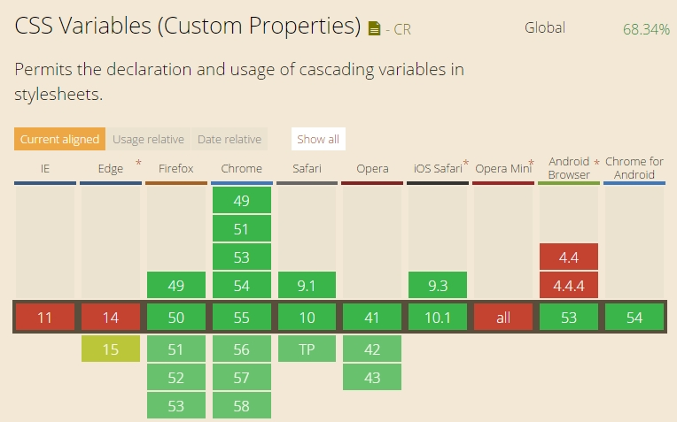

# CSS3原生变量var

### 原生变量var
除了预编译工具sass、；less等支持书写变量外，css3还支持了在css源码中使用变量

### 兼容性



### 语法
##### 1. CSS中原生的变量定义语法是：--varname，变量使用语法是：var(--varname)；
```html
body{
    --color: orange;
    background-color: var(--color);
}
```

##### 2. 变量名
varname变量名 可以[0-9a-zA-Z-_]的组合，也可以是中文，不能包含$，[，^，(，%等特殊字符。
```
body{
    --color: orange;
    --字体颜色: white;
    background-color: var(--color);
    color:var(--字体颜色);
}
```

##### 3. css变量支持默认值,d当设置的变量值不未定义时时默认值将生效；如果变量定义了，只是值不合法，则默认值将无法生效

```
div{
    --fontSizeNum: 20;
    --fontsize: var(--fontSizeNum)px;
    color: var(--c,blue);// --c未定义，则blue生效
}
```

```
div{
    --c:haha;
    --fontSizeNum: 20;
    --fontsize: var(--fontSizeNum)px;
    color: var(--c,blue);// --c的值不合法，则color的默认值不生效，将使用继承的color值
}
```

##### 4. 变量的相互引用及空格问题
在同一个{}中定义的变量可以被其他变量引用，但是引用时，会在所引用变量后面加上空格，因此并不是总是能成功；可通过calc来兼容
```
// 不生效
div{
    --fontSizeNum: 20;
    --fontsize: var(--fontSizeNum)px;// 等同于 --fontsize: 20 px
}
```

##### 其他
- css 变量不支持多个变量同时声明
- css变量不能声明属性名

相关文档

- [css变量规范](https://drafts.csswg.org/css-variables/)
- [小tips:了解CSS/CSS3原生变量var](http://www.zhangxinxu.com/wordpress/2016/11/css-css3-variables-var/)