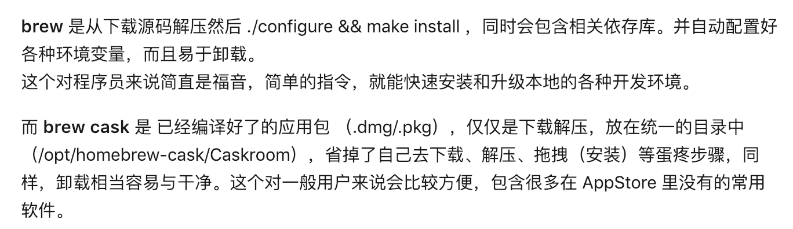
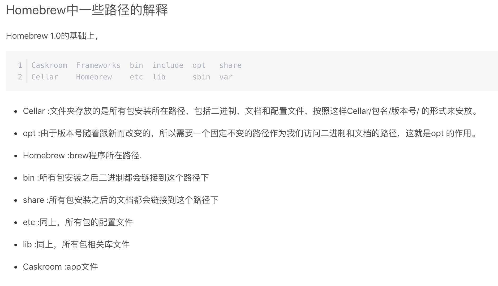

## 快捷键

[Mac 官方键盘快捷键](https://support.apple.com/zh-cn/HT201236)

#### 1. 如何打开共享磁盘
打开finder，快捷键 com + k，输入`smb://databox.oa.com`

### 2. 一些用到的快捷键，少问人

```shell
fn+F11:快速显示桌面
Control-Command-F：全屏使用应用（如果应用支持）
Command-Tab：在打开的应用中切换到下一个最近使用的应用。 
Command-逗号 (,)：打开最前面的应用的偏好设置。
Command-F:查找
Command-G：再次查找：查找之前所找到项目出现的下一个位置。
Shift-Command-G：要查找出现的上一个位置。
```

### 3.finder中的一些快捷键
```
Command + Shift + .(⌘⇧.) ：在 Finder 中显示隐藏的文件
Command–左中括号 ([)：前往上一文件夹。
Command–右中括号 (])：前往下一个文件夹。
Command–上箭头：打开包含当前文件夹的文件夹。
```

## brew

设置源及重置：<https://blog.csdn.net/Boyqicheng/article/details/80809983>

#### 1. 安装

```shell
/usr/bin/ruby -e "$(curl -fsSL https://raw.githubusercontent.com/Homebrew/install/master/install)"
```

#### 2. brew 和brew cask的区别




#### 3. 安装nvm

注意换行

```shell
# 1.
brew install nvm
# 2.
echo "export NVM_DIR=\"\$HOME/.nvm\"">>~/.bash_profile
# 3.
echo ". \"/usr/local/opt/nvm/nvm.sh\"">>~/.bash_profile
# 4.
echo "export NVM_NODEJS_ORG_MIRROR=https://npm.taobao.org/mirrors/node">>~/.bash_profile
# 5. 
source ~/.bash_profile

```

#### 4. 安装一些常用软件

```shell
# 安装Node
nvm install 8
# 设置npm镜像切换工具
npm i nrm -g
# 安装Gulp
npm install -g gulp
# Chrome
brew cask install google-chrome
# 抓包工具wireshark
brew cask install wireshark
# Git Gui工具sourcetree
brew cask install sourcetree
# 屏幕取色工具sip
brew cask install sip
# 终端工具iTerm2，支持sz/rz
brew cask install iterm2
# sz/rz
brew install lrzsz
# Mysql图形化客户端
brew cask install sequel-pro
# 图片压缩工具
brew cask install imageoptim
# diff/merge工具
brew cask install beyond-compare
# hosts切换工具
brew cask install switchhosts
# 为hosts加上可写权限，否则switchhosts改不了hosts文件
sudo chmod g+w /etc/hosts
# 微信
brew cask install wechat
# qq
brew cask install qq
# 企业微信
brew cask install wxwork
# 压缩/解压工具，用它压缩发给windows不乱码
brew cask install keka
# vscode
brew cask install visual-studio-code
# sublime text
brew cask install sublime-text
# 窗口大小管理工具（收费）
brew cask install moom
# sketch设计软件（收费）
brew cask install sketch
# 虚拟机（不含镜像）
# virtualbox有可能会要求特别的权限，会打开一个GUI界面，要点允许/通过/同意之类的，点完后会安装失败
# 需要再运行一次，就安装成功了
brew cask install virtualbox

# 替换mac的搜索功能 Command+space
# 安装以后需要先改变原有的搜索的快捷键然后再设置alfred的快键键
brew cask install alfred
# 安装快捷键提示功能：CheatSheet,安装后长按Command
brew cask install cheatsheet 
# 命令行提示工具，见https://github.com/denisidoro/navi
brew install denisidoro/tools/navi
# 安装截图工具
brew cask install jietu
```

## 一些其他设置

#### 1.允许使用任何来源app（主要用于破解软件）
```
# 运行后再手工将系统安全设置改为 允许任何来源
sudo spctl --master-disable
```

#### 2. 工具
```
# itsycal：mac是没有显示日历的，可以使用这个，https://www.mowglii.com/itsycal/
```

#### 3. 使用iterm2替换原生丑丑的终端
```
# 1. 安装iterm2替换终端
brew cask install iterm2

# 2. 配置zsh，美化命令行的输出
chsh -s /bin/zsh

sh -c "$(curl -fsSL https://raw.githubusercontent.com/robbyrussell/oh-my-zsh/master/tools/install.sh)"

echo "source ~/.bash_profile">>~/.zshrc

# 3.安装autojump，点击控制台上输出的的目录或则文件名即可跳转至目录或打开文件
brew install autojump

echo "[ -f /usr/local/etc/profile.d/autojump.sh ] && . /usr/local/etc/profile.d/autojump.sh">>~/.zshrc
```

#### 4. 设置alias别名，少敲一些字母
```
# 设置ll别名
echo "alias ll=\"ls -al\"">>~/.bash_profile
```
可以直接编辑~/.bash_profile文件进行设置

#### 5. 开启适用于 Force Touch 触控板的“三指拖移”
<https://support.apple.com/zh-cn/HT204609>

#### 6. 破解office
<https://www.jianshu.com/p/2172835cfb17>

## 配置nginx，php

#### 1. 安装nginx
```
# 1.安装nginx
brew install nginx
# 2.添加虚拟主机
vi  /usr/local/etc/nginx/nginx.conf
# 在最底部加上配置
include conf.d/*.conf;
# 执行生效
sudo nginx -c /usr/local/etc/nginx/nginx.conf
```
/usr/local/etc/nginx/conf.d 下的.conf 配置文件即可生效

#### 2. 安装php
mac可能只带php，但是很多模块并没有安装，所以建议卸载自带php，然后自行安装
