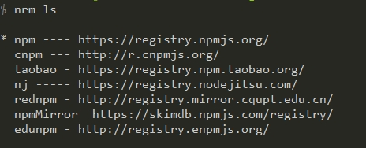
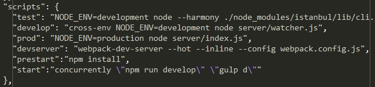
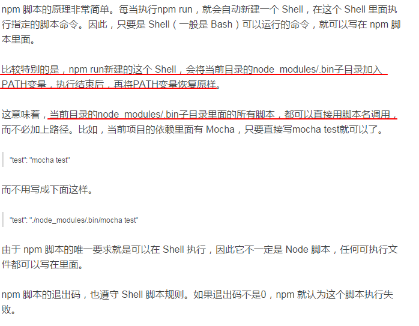
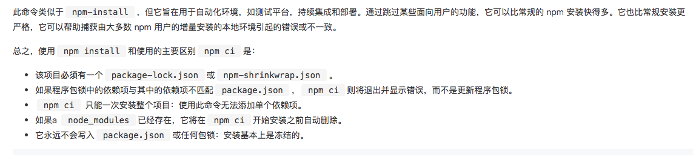

## npm笔记

## 笔记

###  实用命令：

###### 1. 实用工具包
**nrm**：用来切换npm仓库源的包




**concurrently**:可以在npm scripts中执行多进程。同时执行多个命令二不用开多个控制台

在日常开发我们经常会遇到一个用于静态资源的服务器，一个是 业务的 Web 服务器，我们也可以单独拆分。 即分开成两个命令启动。这个适合使用 concurrently 就非常方便了。



**npm-run-all**：可以以串行或者并行的方式执行多个命令；功能上比concurrently多一些。concurrently强调执行多个进程，npm-run-all的功能在于可以串行或者并行执行。

**cross-env**:跨平台地设置及使用环境变量

大多数情况下，在windows平台下使用类似于: NODE_ENV=production的命令行指令会卡住，windows平台与POSIX在使用命令行时有许多区别（例如在POSIX，使用$ENV_VAR,在windows，使用%ENV_VAR%。。。）

cross-env让这一切变得简单，不同平台使用唯一指令，无需担心跨平台问题

###### 2. 全局模式和本地模式
node的安装分为全局模式和本地模式。直接通过require()的方式是没有办法调用全局安装的包的。全局的安装是供命令行使用的

###### 3. npm outdated
检查包是否已经过时，此命令会列出所有已经过时的包，可以及时进行包的更新

###### 4. npm view
```
npm view ui-mcalendar versions：查看某个package的所有版本信息
npm view moduleNames：查看node模块的package.json文件夹
npm view moduleName repository.url：查看包的源文件地址
npm view moudleName dependencies：查看包的依赖关系
```

###### 5. npm conifg
```
npm config list：参看当前node的配置信息
npm config get [keyName]：参看当前node的配置信息中具体的属性，这里指list中出现的属性
npm config set registry https://registry.npmjs.org/: 设置npm的镜像源地址
```

###### 6. 发布及安装
```
npm root：查看当前包的安装路径
npm root -g：查看全局的包的安装路径
npm update moduleName：更新node模块
npm uninstall moudleName：卸载node模块
npm publish: 发布某一个包至npm
npm unpublish packageName@x,y.x: 取消某个版本的发布状态
npm prune: 列出在node_modules中存在但是为在package.json中保存的npm包
npm home $package: 打开某个包的主页
npm home: 直接在某个项目下运行npm home即打开项目主页
npm install --only=dev:只安装devDependencies中的依赖
npm owner ls tool-callapp：列出当前等发布包的账号
```

###### 7. env
```sh
env
```
列出所有的环境变量,注意需要在bash的环境下运行

###### 8. npm run原理



###### 9. `.npmrc`文件
- 运行npm命令时，npm会从这几个地方读取命令配置：命令行参数，系统环境变量，.npmrc文件。
- .npmrc文件中可以描述着npm的一些配置，比如registry，详细的配置内容见：https://www.npmjs.com.cn/misc/config/
- 查找.npmrc配置的时候，顺序及优先级是这样的：
    + `/path/to/my/project/.npmrc`：项目的.npmrc 配置，需要和package.josn 以及node_modules属于同一级目录。
    + `~/.npmrc`：用户目录中的.npmrc配置
    + `$PREFIX/etc/npmrc`: npm 的全局配置：
        * 运行`npm config get prefix`就可以知道
        * win系统的路径基础部分是：`%APPDATA%/npm/`
        * mac系统下路径基础部分是：`/usr/local/`
    + `/path/to/npm/npmrc`: npm 安装目录的配置
        * 运行`npm root -g`即可查到`/path/to`对应的位置，

###### 10. npm ci 与npm install 区别

- npm ci从npm@5.7.1开始支持



###### 11. npm 和 lock文件

- 在npm 5.0 ~ 5.6中间对package-lock.json的处理逻辑更新过几个版本，5.6以上才开始稳定
- 这里查看过往的node版本自带的npm版本 <https://nodejs.org/zh-cn/download/releases/>

## 学习参考链接

- 你所需要的npm知识储备都在这了:<https://juejin.im/post/5d08d3d3f265da1b7e103a4d>
- package.json 字段说明: <http://mujiang.info/translation/npmjs/files/package.json.html>
- npmjs: <https://docs.npmjs.com/cli/>
