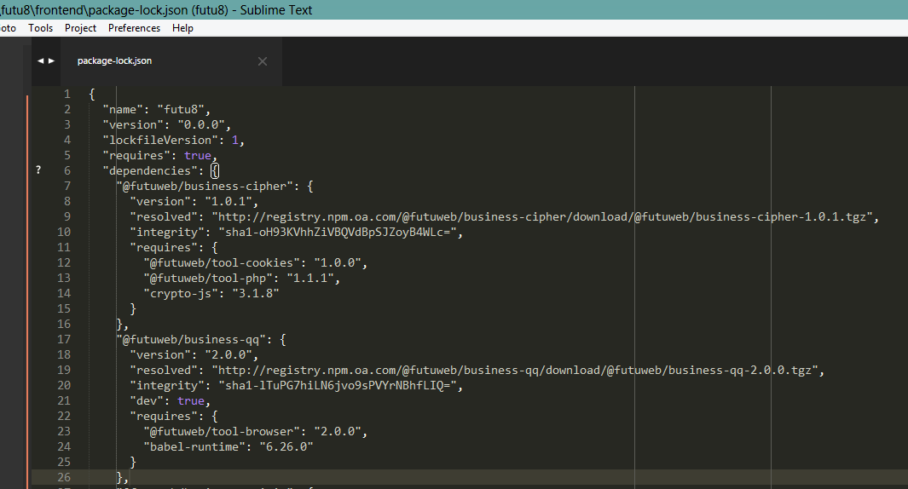
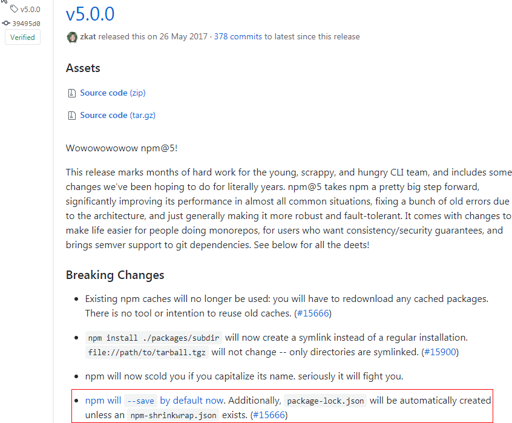

## package-lock.json

### 1. 背景

我们常常看到这样一个文件，例如package-lock.json

在安装依赖的过程中，你会发现：
- 安装组件时，会多出一个叫 `package-lock.json`的文件
- 在此项目中，更新package.json 中的组件版本号之后，重新`npm i`时，安装的npm 包还是旧版本

这还要从npm升级 5.0.0之后说起。

### 2. package-lock.json的产生

在`npm`的[changelog](https://github.com/npm/npm/releases?after=v5.0.4)中可以看到，`npm 5.0.0`发布以后, 每次安装前端组件执行`npm - @futuweb/xxxx --save`时会默认产生package-lock.json。

### 3. package-lock.json是什么，其作用是什么

### 4. 如何保证 package-lock.josn对开发环境无影响