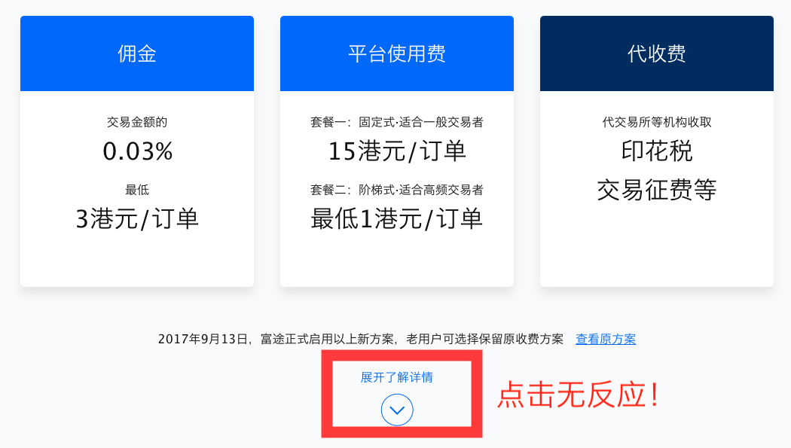

# touchstart与click不得不说的故事


## 写在最前

最近给公司做了个自适应的的费用介绍页，主要是关于收费标准的调整，老板表示很重视，适用人群也很多，所以也反馈得到几个不常遇到的问题，其中一个就是关于`touchstart`与`click`事件的问题。这里记录一下，欢迎指正。

## 1. 问题

某天中午，开发了好几天的费用介绍页终于上线了。运营同学满怀信心地发送了收费标准页面的推广消息，然后我们都潇洒地吃午饭去了。正吃着午饭的时候，收到微信群中某客户的反馈：我们的页面最关键的地方——收费详情点击没有反应！



随后我们查看了前端错误上报和日志，没有任何线索。与客户确认环境，客户使用的是 windows PC 。

但奇怪的是，我测试了多台设备，仍然无法重现问题。在同事的机器上也没能复现这个问题。

## 2. 溯源

我们重新审视了一遍事件绑定的代码，发现其实非常简单。

```
var tap = 'ontouchstart' in window ? 'touchstart' : 'click';
wrap.addEvenListener(tap, function(){
    signUp();
});
```

唯一有点特殊的就是我们的页面是自适应的，为了避免移动端点击 300ms 延迟，在绑定前做了一下判断，移动端绑定了`touchstart`事件，PC 端绑定了`click`事件。然而这段代码看起来也是人畜无害，并不至于导致点击没有反应。


## 3. 定位

我们再次询问了客户更详细的环境信息，获得了一个非常关键的信息，客户使用的是联想的笔记本。由于在 surface 出来的时候组里有同事关注过，想起来当时联想也出了很多触屏笔记本。于是和客户再次联系，确认了他使用的就是联想的触屏笔记本。

至此问题就非常明确了，问题最终还是定位在绑定的“点击”事件上。我们在检测时只是粗暴地检测了设备是否支持触控事件，却忽略了支持触控事件的仍然可能是 PC 设备，客户仍然可能通过点击鼠标来进行操作。这实际上反映出我们忽略了用户设备的多样性，开发的时候对用户设备做了太多的假设，最终导致我们以为它是一台手机，结果它是一台货真价实的笔记本电脑。

归纳起来，关键的点就是：

- 有些 PC 设备屏幕为触摸屏，同时支持`touchstart`和`click`事件；
- 用户触发`touchstart`事件，默认必然会导致触发`click`事件，但是触发`click`事件，不一定会导致`touchstart`事件被触发；
- 此类设备外接鼠标时，通过上面的绑定方式，会绑定`touchstart`事件，但是鼠标操作只能触发`click`，导致`touchstart`不触发；

## 4. 解决办法

至此，问题的原因已经分析完毕，如何应对又成了一个问题。这个问题的关键在于确定不同设备上使用“点击”事件的策略。大致分为如下几种：

### 1. 均使用click事件

- 优点：自适应时，不同设备均支持，没有兼容性问题，开发成本低；
- 缺点：移动端存在300ms的延迟问题（虽然同事表示一般感觉不出来）

### 2. 通过UA判断设备是否为移动端，再确认事件类型

```
function isMobile() {
    return navigator.userAgent.match(/(blackberry|configuration\/cldc|hp |hp-|htc |htc_|htc-|iemobile|kindle|midp|mmp|motorola|mobile|nokia|opera mini|opera |Googlebot-Mobile|YahooSeeker\/M1A1-R2D2|android|iphone|ipod|mobi|palm|palmos|pocket|portalmmm|ppc;|smartphone|sonyericsson|sqh|spv|symbian|treo|up.browser|up.link|vodafone|windows ce|xda |xda_)/i) ? true : false;
}
 var tap = isMobile() ? 'touchstart' : 'click';
```

- 优点：自适应时，开发成本低，通过设备类型确定点击事件类型，能满足绝大部分问题，用户操作也比较符合预期；
- 缺点：不能满足所有情况，如果用户给 iPad 或者 Android 手机（认定为移动设备）外接鼠标进行操作，这种方式就不起作用（PS：你非要这么做，我也无FUCK说）。

### 3. 全部使用click，通过FastClick解决300毫秒的延迟问题

```
//引入FastClick
var FastClick = require('tool-fastclick');
//页面初始化时调用
new FastClick(document.body);
```

- 优点：开发成本低也比较低，也不会出现1，2中问题
- 缺点：额外引入三方库，FastClick 是否会有其他的坑？这点不能保证

> 注：`tool-fastclick`是组内 fork 的 FastClick 版本，目前没有开源。我们对其中存在的问题进行了一部分修复，比如：同个页面有多个 select 框选择时，会跳选项的 bug 。

### 4. 万全之策

其实最好的方案是不要在绑定的时候进行判断，而是对`touchstart`和`click`同时绑定，但是在`touchstart`触发的时候暂时取消后续 click 的响应。

具体的实施方式有三种：

1. 在`touchstart`事件响应中调用`preventDefault()`方法，阻止后续`click`事件的触发
2. 在`touchstart`事件中设置一些标记，或者取消`click`事件的绑定，使得`click`事件触发时不会触发我们绑定的逻辑，在一段时间（例如300-500ms）后再恢复
3. 直接对事件处理函数进行节流（throttle），保证在一段时间内（300ms - 500ms），事件处理函数只触发一次

当然，和上面一样，每种方案都有利弊。

方案1取消了后续`click`事件的触发，在多个事件绑定叠加或者多人合作的时候，有可能导致一些依赖`click`事件的逻辑出现bug。

方案2和方案3的原理基本一样，实施起来有一定的复杂度，而且本质上属于 hack 的方案，应对一些非常规场景时就不适用了。比如需要快速连续点击的场景，或者用户点击非常慢的场景等等。

总之，没有万全之策，呵呵……

## 最后

有人可能会对文章最前提到的收费介绍页比较感兴趣，来了，看[这里](https://www.futu5.com/about/commissionnew)。
