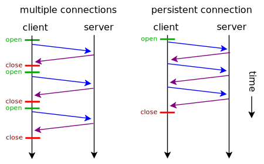
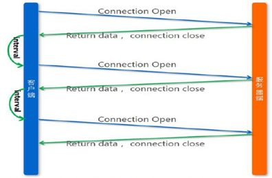
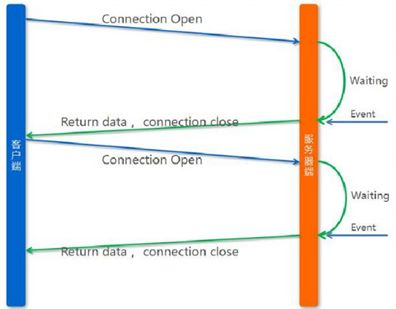
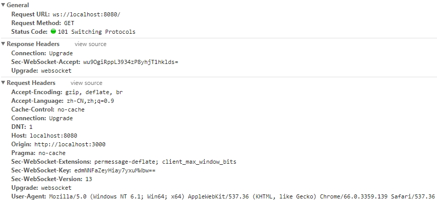
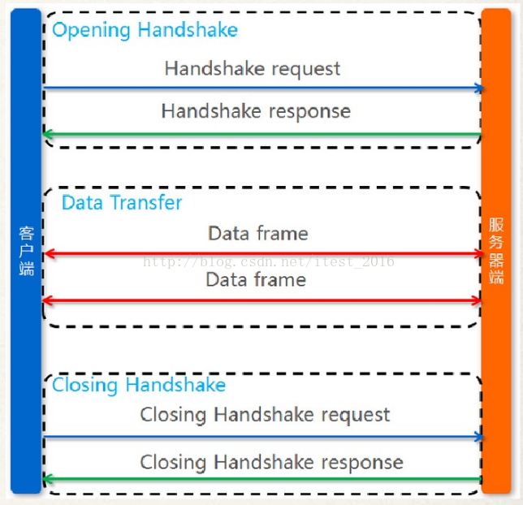
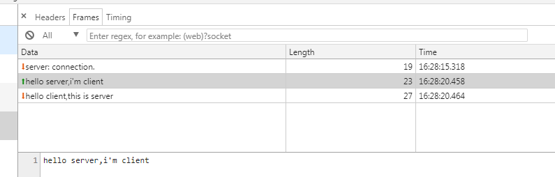

# websocket

## 前置知识

在学习websocket的时候，往往需要对照http协议来比较，因此是十分必要先普及一下http的相关知识。

#### http1.0/1.1、keep-live
1. http是一个请求-响应的协议，也就是一个Request对应一个response，不会对应多个。而且顺序也是先有请求再有响应，response不能主动发起。
2. http协议分为了0.9(已过时)，1.0 和 1.1，2.0(这里不讲)。
3. 在http1.0 中，每一个http请求，客户端都要和服务端新建一个TCP连接，完成之后立即断开连接；在http1.1 中，引入了保持连接（keep-live）的机制,一次TCP连接，可以有多组请求-响应，而不必多次建立TCP连接。



#### 短轮询、长轮询

- 短轮询: 在特定的的时间间隔（如每1秒），由浏览器对服务器发出HTTP请求，然后由服务器返回最新的数据给客户端的浏览器.



- 长轮询: 一次HTTP请求的过程中，若是服务器端数据并没有更新，那么则将这个连接挂起，直到服务器推送新的数据，再返回



>注意：

>1. 经常会有文章提到短链接、长连接，这个是TCP才有的;

>2. HTTP1.1 里面，Connection为keep-alive时，使用的就是TCP长连接，而HTTP本身没有长连接，短链接之说。

>3. 长短轮询是服务端通过编程的方式来实现的，而长短链接是通过TCP传输协议来规定和实现的。

## 一、什么是websocket

#### 0. 什么是websocket
- 一种浏览器和服务器间进行`双向会话`的高级技术(新协议)，在HTML5中开始支持
- 可以向服务器发送消息
- 接受基于事件驱动的响应，而不是向服务器轮训

一次websocket连接如下:


#### 1. 和普通HTTP协议的异同

###### 相同点：

1. 都是计算机网络应用层的协议。
2. 都是基于TCP来简历连接，使用相同的TCP端口；默认情况下，Websocket协议使用80端口；运行在TLS之上时，默认使用443端口。
3. 类似于与http与https，websocket也分为`ws`和`wss`协议头
```
ws://example.com/wsapi
wss://secure.example.com/
```

###### 不同点/特点：
1. Websocket其实是一个新协议，跟HTTP协议基本没有关系,它是HTTP协议上的一种补充,有交集，但是并不是全部。


2. websocket是双向会话，可以互相主动请求发出消息，而HTTP需要客户端向服务端发起请求，服务端才能给出响应


3. 在websocket应用中，Websocket协议通过第一个request建立了TCP连接之后，之后交换的数据都不需要发送 HTTP header就能交换数据，而每一次HTTP请求，服务端和客户端自己钱都要交换大量的请求头、



###### 联系

WebSocket在建立握手连接时，数据是通过http协议传输的，这里面用到的只是http协议一些简单的字段。但是在建立连接之后，真正的数据传输阶段是不需要http协议参与的。
建立连接的过程是这样的：

1. 浏览器与WebSocket服务器通过TCP三次握手建立连接，如果这个建立连接失败，那么后面的过程就不会执行，Web应用程序将收到错误消息通知。

2. 在TCP建立连接成功后，浏览器通过http协议传送WebSocket支持的版本号，协议的字版本号，原始地址，主机地址等等一些列字段给服务器端。例如：
```
GET ws://localhost:8080/ HTTP/1.1
Host: localhost:8080
Connection: Upgrade
Pragma: no-cache
Cache-Control: no-cache
Upgrade: websocket
Origin: http://localhost:3000
Sec-WebSocket-Version: 13
User-Agent: Mozilla/5.0 (Windows NT 6.1; Win64; x64) AppleWebKit/537.36 (KHTML, like Gecko) Chrome/66.0.3359.139 Safari/537.36
DNT: 1
Accept-Encoding: gzip, deflate, br
Accept-Language: zh-CN,zh;q=0.9
Sec-WebSocket-Key: FFIay2n7pxO1jRaR4IiuBw==
Sec-WebSocket-Extensions: permessage-deflate; client_max_window_bits
```

3. WebSocket服务器收到浏览器发送来的握手请求后，如果数据包数据和格式正确，客户端和服务器端的协议版本号匹配等等，就接受本次握手连接，并给出相应的数据回复，同样回复的数据包也是采用http协议传输。
```
HTTP/1.1 101 Switching Protocols
Upgrade: websocket
Connection: Upgrade
Sec-WebSocket-Accept: RH4E4orwcBih78+xUKYeQYWgsCQ=
```

4. 浏览器收到服务器回复的数据包后，如果数据包内容、格式都没有问题的话，就表示本次连接成功，触发onopen事件，此时通过send接口想服务器发送数据。否则，握手连接失败，触发onerror事件,数据传输过程不需要http协议的参与。

#### 2. websocket VS http

###### 优点

- `被动VS主动`:websocket全双工，浏览器和服务端可以相互主动发消息。
- `即时通讯`: websocket相对于http的优点，更多的体现在即时通讯应用上。相比于传统的实现方式
短轮询、长轮询，websocket的优势在于：
    - header：每一次HTTP请求，服务端和客户端自己钱都要交换大量的请求头、
，而websocket只在建立连接是才交换http header；
    - 效率：短轮询中客户端频繁的发请求，服务端的数据无变化，造成通信低效；长轮询在通信不频繁时，后端有数据变化时才给与客户端回复，一个http请求的周期过长，实时性不高，在通信比较频繁的时候，和短轮询的形式比较相近。
    - 实现：长短轮询的实现都需要通过代码来控制实现，而websocket本身就支持双向通讯，开发起来更加简单。
- `跨域`：websocket不适用于同源策略，支持跨域通信；WebSocket 客户端和服务端建立连接时，header中带有origin字段标识脚本请求的源，服务端可以根据该字段来判断是否同意建立连接。

###### 缺点

#### 3. 学习门槛

#### 4. 兼容性

- 支持性良好
- IE9 上不适用


## 二、Step-by-Step

#### 1. 服务端
NodeJS本身并没有原生的WebSocket支持，但是有第三方的实现。这里，选择`ws`来作为服务端实现。使用koa2来搭建http服务。

```
/**
 * node ./test/server.js
 */
const Koa = require('koa');
const app = new Koa();
const staticServe = require('koa-static');
const logger = require('koa-logger');
const path = require('path');

// 静态资源目录对于相对入口文件server.js的路径
const staticPath = path.join(__dirname, '../');
// 装载路由
app.use(logger())
    .use(staticServe(staticPath, {
        index: 'index.html'
    }));

// websocket
const WebSocketServer = require('ws').Server;
const wss = new WebSocketServer({
    port: 8080
});

// 建立连接
wss.on('connection', function connection(ws) {
    console.log('server: connection.');
    // 接受客户端消息
    ws.on('message', function incoming(message) {
        console.log('server: received: %s', message);
        // 向客户端发送消息
        ws.send('hello client,this is server');
    });
    ws.send('server: connection.');
});

// 启动server并打开默认链接
app.listen(3000, () => {
    console.log('start on http://localhost:3000');
});

```

#### 2. 客户端

客户端直接直接使用webSocket对象建立连接。

```
// 实例化一个连接
var ws = new WebSocket ('ws://localhost:8080');

Object.assign(ws,{
    // 建立连接
    onopen: function(){
        console.log('opened');

        // FASO发送消息
        ws.send('hello server,i\'m client');
    },
    // 接受到消息
    onmessage: function(e){
        console.log('mesasge:' + e.data);
    }
});
```

#### 3. 协议详解

建立连接：
```
GET ws://localhost:8080/ HTTP/1.1
# 请求的方法必须是GET，HTTP版本必须至少是1.1

Host: localhost:8080
# 建立连接的服务端host

Connection: Upgrade
#表示客户端希望连接升级

Pragma: no-cache
Cache-Control: no-cache
# 请求不缓存

Upgrade: websocket
#表示希望升级到Websocket协议 

Origin: http://localhost:3000
#表示在浏览器中发起此Websocket连接所在的页面，类似于Referer。但是，与Referer不同的是，Origin只包含了协议和主机名称,服务端可以根据此字段来决定是否建立连接

Sec-WebSocket-Version: 13
#表示支持的Websocket版本，目前必须只能是13，之前版本已弃用。

User-Agent: Mozilla/5.0 (Windows NT 6.1; Win64; x64) AppleWebKit/537.36 (KHTML, like Gecko) Chrome/66.0.3359.139 Safari/537.36
#客户端代理信息

DNT: 1
# DO NOT TRACK的缩写，要求服务器程序不要跟踪记录用户信息

Accept-Encoding: gzip, deflate, br
#浏览器可以处理的编码方式

Accept-Language: zh-CN,zh;q=0.9
#浏览器接收的语言，其实也就是用户在什么语言地区

Sec-WebSocket-Key: FFIay2n7pxO1jRaR4IiuBw==
#一个随机的经过base64编码的字符串，像密钥一样用于服务器和客户端的握手过程

Sec-WebSocket-Extensions: permessage-deflate; client_max_window_bits
# 扩展请求头字段

```

响应连接：
```
HTTP/1.1 101 Switching Protocols
# 通过Upgrade消息头通知客户端采用不同的协议来完成这个请求

Upgrade: websocket
# 表示升级的协议为websocket

Connection: Upgrade
# 表示升级连接

Sec-WebSocket-Accept: RH4E4orwcBih78+xUKYeQYWgsCQ=
# 根据客户端请求首部的Sec-WebSocket-Key计算出来的值，同Sec-WebSocket-Ke一起提供基础的防护，减少恶意连接、意外连接
```

## 三、适用场景与问题

#### 适用我们的场景
1. 在线咨询【不兼容IE9】
2. walle发布系统

#### 问题
1. 跨域如何鉴权？跨域时cookie无法被携带
2. 

### 参考链接：
- [HTTP Keep-Alive模式](http://www.cnblogs.com/skynet/archive/2010/12/11/1903347.html)
- [WebSocket：5分钟从入门到精通](https://mp.weixin.qq.com/s/JPU0CsZ2ktnMRz5XtgBlPQ)
- <https://www.liaoxuefeng.com/wiki/001434446689867b27157e896e74d51a89c25cc8b43bdb3000/001472780997905c8f293615c5a42eab058b6dc29936a5c000>
- [全双工通信的 WebSocket](https://juejin.im/post/5b0351b051882542821ca2a1?utm_source=gold_browser_extension)
- [WebSocket实战](http://ued.sina.com.cn/?p=900)
- [爱测未来性能-你不得不知道的WebSocket](https://blog.csdn.net/itest_2016/article/details/72395818)
- [WebSocket 是什么原理？为什么可以实现持久连接](https://www.zhihu.com/question/20215561)
- [谈谈HTTP协议中的短轮询、长轮询、长连接和短连接](https://mp.weixin.qq.com/s/Jo2G-1OE8s8BEEdsnjAhtQ)