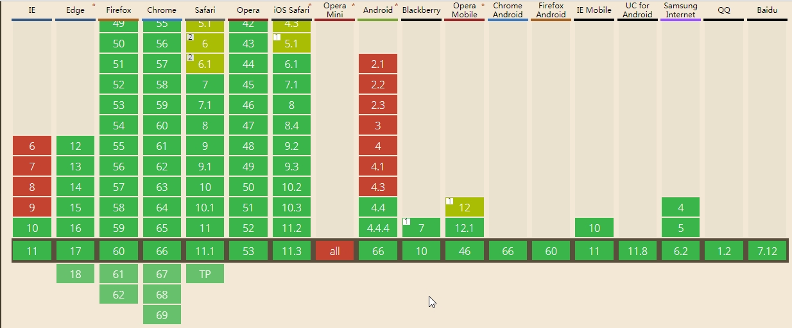

# websocket

## 一、什么是websocket

#### 0. websocket
- 一种浏览器和服务器间进行`双向会话`的高级技术
- 可以向服务器发送消息
- 接受基于事件驱动的响应，而不是向服务器轮训

#### 1. 和普通HTTP请求的异同

（1）. 相同点：

- 基于TCP的应用层协议
- 默认端口是8080

（2）. 不同点：

- websocket 实现了实时双向通信,服务器端和客户端可以同时发送并响应请求,而HTTP是请求-响应的方式

#### 2. 有哪些优点

#### 3. 学习门槛

#### 4. 兼容性

- 支持性良好
- IE9 上不适用

> 
## 二、开发入门

## 三、Step-by-Step

#### 1. 服务端
NodeJS本身并没有原生的WebSocket支持，但是有第三方的实现。这里，选择`ws`来作为服务端实现。

#### 2. 客户端

## 四、适用场景

## 五、最佳实践

### 参考链接：
- https://mp.weixin.qq.com/s/JPU0CsZ2ktnMRz5XtgBlPQ
- http://www.ruanyifeng.com/blog/2017/05/websocket.html
- https://www.liaoxuefeng.com/wiki/001434446689867b27157e896e74d51a89c25cc8b43bdb3000/001472780997905c8f293615c5a42eab058b6dc29936a5c000
- https://juejin.im/post/5b0351b051882542821ca2a1?utm_source=gold_browser_extension