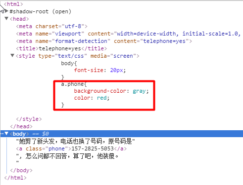
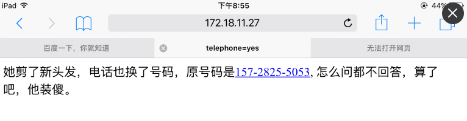

# 总结下工作中遇到的坑

#### 记录下工作中遇到的坑，以便于日后复习！
#### 2016/06/01-至今

1. Firebug重复提交问题
说明：在firbug控制台下，查看网络请求时，当鼠标移动到某url时 ，firebug会再次请求该url，在调试验证码时，经常遇到这个坑；通过抓包工具fiddler可以发现这个问题。

2. 在一些网页上，为了在ios设备上识别数字为电话号码，经常会在head标签中加入如下标签：
    ```
    <meta name="format-detection" content="telephone=yes"/>
    ```
    但此时，被识别为电话号码的标签（通常为a标签）的样式将无法改变。
    [代码](demos/01.html)：
    
    IOS上的效果：
    

    解决办法为设置`content="telephone=no"`,通过a标签中的tel属性来识别数字为电话号码。
    [代码](demo02.html)：
        
        ```
        <html>
        
        <meta name="format-detection" content="telephone=no"/>
       
        <a href="tel:157-2825-5053">157-2825-5053</a>
        
        </html>
        ```
    [了解更多](https://css-tricks.com/the-current-state-of-telephone-links/)

3. gulp中task的异步执行：加上return
在gulpfile中，多个task和里面的gulp流是异步执行的，导致task的任务存在不按顺序执行的问题。
案例：打包时，先通过替换版本号（[工具](https://github.com/AlanZhang001/gulp-rev-hash3)），uglifyjs等操作，然后自动提交至代码库
    ```
    gulp.task('ci', function(){
        return runSequence('git-pull', 'webpackProd', 'rev', 'rev-static', 'git-commit');
    });
    ```
但是在配置rev（Task用于替换版本号）时没有return操作，导致经常发生代码commit了之后再执行的rev。此次只要在task中加上return即可。
    ```
    gulp.task('rev', function(){
        // 此处应该加上return
        return  gulp.src('./views/**/*.html')
            .pipe(rev({
                assetsDir:'./web',
                remotePath: [{
                    domain:"cdnact.futunn.com",
                    path:"act/web"
                }, {
                    domain:"www.futunn.com",
                    path:"frontend/web"
                }],
                // 项目根目录路径，相对路径，相对于gulpfile
                projectPath:"../"
            }))
            .pipe(gulp.dest('./views'));
    });
    ```
> [了解更多](http://stackoverflow.com/questions/21699146/gulp-js-task-return-on-src)

4. IOS浏览器上，对于绑定了click时间段元素，特别是对于存在弹出层隐藏或者消失的场景，会存在页面出现灰色线条或者阴影的效果，这是IOS特性的效果。stackover的解答：[http://stackoverflow.com/questions/2355154/iphone-darkens-div-on-click](http://stackoverflow.com/questions/2355154/iphone-darkens-div-on-click)。解决办法：

    ```
    html{
        -webkit-tap-highlight-color: transparent;
    }
    ```
