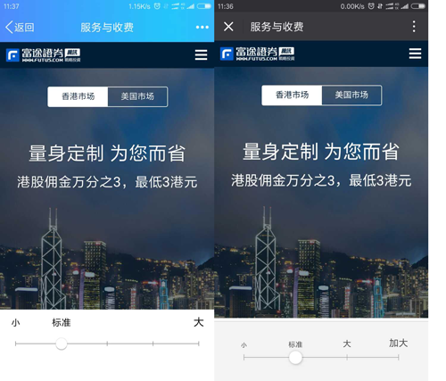
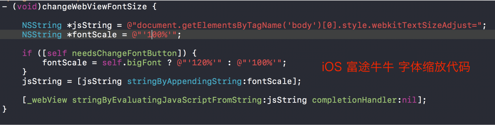
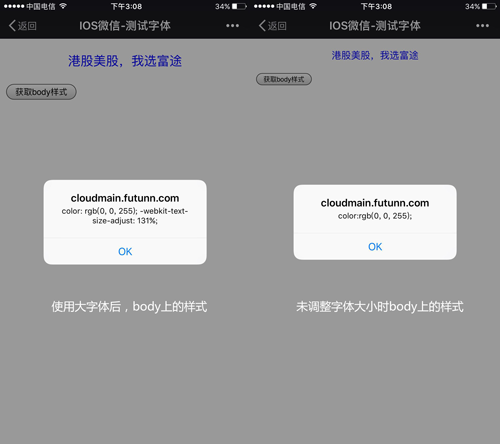
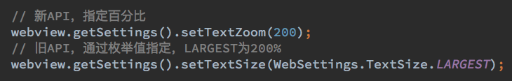
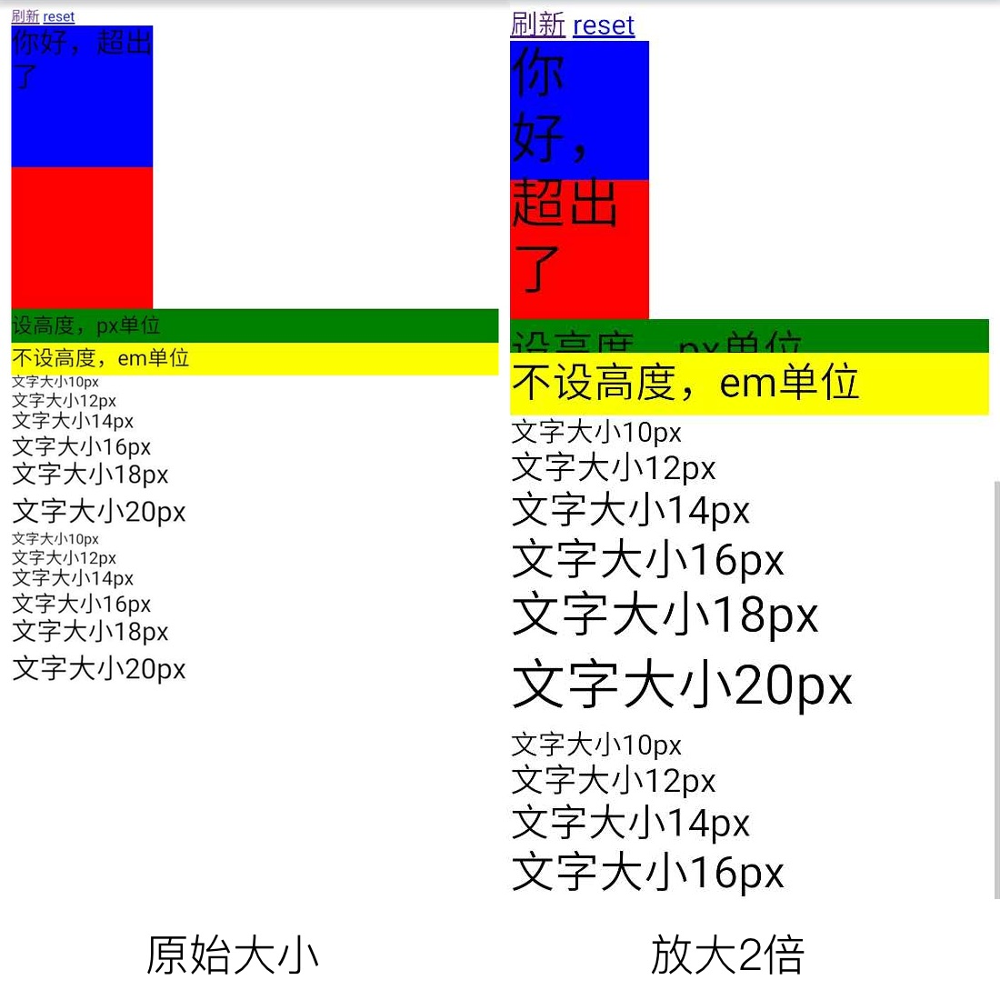
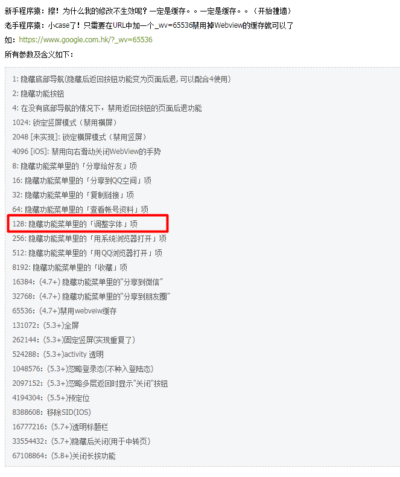

# 移动端字体放大问题的研究

## 问题背景

很多webview提供了调整页面字体大小的功能，例如手机QQ、微信、部分Android内置浏览器等。大部分浏览器调整字体只会导致字体显示大小发生改变，其他元素的大小不受影响。但对于结构稍微复杂一点的页面，字体大小的变动就足以导致页面布局乱掉，导致文本不居中、文字折行、布局混乱等问题。



作为前端工程师，碰到页面乱掉的情况就会觉得很无辜了，明明是你自己放大的字体，放大了却还要我来承担排版乱掉的后果，多委屈啊。很久以前，在PC端，好歹我们还可以提示用户按CTRL + 0将页面的比例调整回来，现在在移动端，却很难阻止用户缩放字体大小。

然而即使再委屈，当问题来了之后还是需要处理的，谁让我们是前端工程师呢？（笑）

## 原理

由于并不是很清楚各个平台（浏览器）放大字体的机制，我分别咨询了我们 iOS 和 Android 的同事，得知在调整字体大小时时，2个客户端的处理方式不同。

### iOS

iOS上需要调整 webview 的字体大小时，是通过给 body 设置 `-webkit-text-size-adjust` 属性实现的：



既然这样，我们应该可以通过JS取到这个属性：

```javascript
var body = document.body;
alert(body.getAttribute('style'));
```



图上可以看到，当页面文字被放大时，确实多了一个`-webkit-text-size-adjust`属性。

### Android

Android通过给 webview 设置字体的缩放来完成，具体的API是`setTextZoom(int)`。



我们通过一个demo页面来查看效果：



从图中可以看到，文字确实是被放大了。例如“文字大小10px”这一段文字被放大了两倍，随文字一同被放大的还有以`em`为单位的尺寸和`line-height`。

于是很自然地想到，我们是否可以取到这些属性呢？

```javascript
// 取元素的fontSize
document.querySelector('.s10').style.fontSize;
```

结果很失望，取不到什么有用的信息。

按iOS的方式，也取不到任何有用的样式，可见Android webview中并不是使用`-webkit-text-size-adjust`这个属性来放大文字的。

一筹莫展之际，忽然想到是否应该取一下`computedStyle`？

```javascript
window.getComputedStyle(document.querySelector('.fs10'),null).getPropertyValue('font-size')
```

这次终于有结果了，“文字大小10px”这一段文字明明白白地被使用了`20px`的文字大小！

至此，我们可以大概推测出 Android webview 放大文字的原理：在CSS解析之后，渲染之前，将所有的字体大小的值进行缩放，后面的排版和渲染都会直接使用缩放后的CSS值。

## 解决方案

针对iOS，调整字体大小本身只是改变`body`的css属性，因此可以通过覆盖样式来控制。

```
body {
    -webkit-text-size-adjust: 100% !important;
}
```

Android因为改变的是字体的大小，所以可以考虑将字体大小在设置的时候进行等比例缩小。例如，一个文字希望以`10px`来进行渲染，当webview被放大两倍时，此时`font-size`会变为`20px`。因此我们可以在取到这个放大比例之后，对原样式进行等比缩小，比如将原文字大小设置为`5px`，渲染的时候就变成了`10px`。

```javascript
var $dom = document.querySelector('.fs10');
var originFontSize = 10;
var scaledFontSize = parseInt(window.getComputedStyle($dom, null).getPropertyValue('font-size'));
var scaleFactor = originFontSize / scaledFontSize;
$dom.style.fontSize = originFontSize * scaleFactor;
```

但是这样做仍然有几个问题：

1. 一次只能操作一个DOM元素，无法批量处理
2. 需要知道DOM元素原来设置的字体大小

这几个问题并不如想象中的好解决。于是另辟蹊径，看看是否有一劳永逸的办法。脑海中很快冒出一个名词——`rem`！

如果我们的页面字体大小都使用`rem`进行声明，那么我们就只需要在页面加载的时候根据缩放比例计算出`html`元素的字体大小即可！详见下方代码：

```javascript
(function(){
    var $dom = document.createElement('div');
    $dom.style = 'font-size:100px;';
    document.body.appendChild($dom);
    // 计算出放大后的字体
    var scaledFontSize = parseInt(window.getComputedStyle($dom, null).getPropertyValue('font-size'));
    document.body.removeChild($dom);
    // 计算原字体和放大后字体的比例
    var scaleFactor = 100 / scaledFontSize;

    // 取html元素的字体大小
    // 注意，这个大小也经过缩放了
    // 所以下方计算的时候 *scaledFontSize是原来的html字体大小
    // 再次 *scaledFontSize才是我们要设置的大小
    var originRootFontSize = parseInt(window.getComputedStyle(document.documentElement, null).getPropertyValue('font-size'));
    document.documentElement.style.fontSize = originRootFontSize * scaleFactor * scaleFactor + 'px';
})();
```

因为这段代码中创建了一个元素，并放入了`document.body`中，所以不能放在`head`中运行。如果放在页尾运行的话，则有可能会产生闪烁的情况，因此最好的办法是将这段代码放在`<body>`开始的地方。

> 除了在Android webview以外，以上代码在 Android 微信中实测也有效。

## 其它方案

### Android微信

在编写本文时，通过网上一些资料，发现在Android微信中，也可以借助`WeixinJSBridge`对象来阻止字体大小调整。实测也有效。

```javascript
(function() {
    if (typeof WeixinJSBridge == "object" && typeof WeixinJSBridge.invoke == "function") {
        handleFontSize();
    } else {
        document.addEventListener("WeixinJSBridgeReady", handleFontSize, false);
    }
    function handleFontSize() {
        // 设置网页字体为默认大小
        WeixinJSBridge.invoke('setFontSizeCallback', { 'fontSize' : 0 });
        // 重写设置网页字体大小的事件
        WeixinJSBridge.on('menu:setfont', function() {
            WeixinJSBridge.invoke('setFontSizeCallback', { 'fontSize' : 0 });
        });
    }
 })();
```

### Android QQ

作为用户量庞大的APP之一，QQ也提供了禁止调整字体大小的方案，android qq中可以自定义webview显示的控件，通过在url中加入指定参数即可。见[如何定制手Q的Webview](http://wiki.open.qq.com/wiki/%E5%A6%82%E4%BD%95%E5%AE%9A%E5%88%B6%E6%89%8BQ%E7%9A%84Webview).



理论上，<http://www.futu5.com/?_wv=128>访问这个链接，功能菜单中不会出现调整字体大小的按钮。但是，但是，但是，在我实测过程中，所有的参数中，就只有【128隐藏字体项不生效】。不知道是QQ的bug还是有意为之，目前已提交反馈，但未收到回应。

## 声音和思考

在组内分享的时候，大家对于字体大小调整这个头疼的问题各自有不同的看法，大概有怎么几种声音：

1. 从产品的角度来说，微信、QQ等客户端既然提供调整字体的功能，必然是想用它来提供更好的体验，不应该禁用。
2. 从开发的角度来说，字体缩放之后，页面会乱掉，根本原因在于页面的适应性不够，应该从代码层面去优化。
3. 继续从开发的角度说，虽然理论上开发应该做好适配，但是对于文字突然被放大两倍，很多时候确实心有余而力不足。如果要做好，需要花费大量的时间和精力，并且需要设计和产品同学从设计上留出一些适配空间。
4. 既然用户选择了用大字体来浏览页面，他就应该知道这个页面是被自己放大了，需要承担页面布局乱掉的结果。

作为开发者，我内心是倾向于第4种声音的，但是从产品的角度考虑，这个锅不能丢给用户。另一方面，在有限时间中，又只能从大部分人的都觉得ok的视觉体验为标准来展开开发，时间充足的情况才有可能再对大字体另做适配方面的考虑（这可能吗？）。

这也许是产品、设计、开发、老板都比较能接受的结果，可以类比国内大部分网站在无障碍浏览上的工作量，不完美，但又很无奈。

## 参考资料

- [如何定制手Q的Webview](http://wiki.open.qq.com/wiki/%E5%A6%82%E4%BD%95%E5%AE%9A%E5%88%B6%E6%89%8BQ%E7%9A%84Webview)
- [微信sdk](http://qydev.weixin.qq.com/wiki/index.php?title=%E5%BE%AE%E4%BF%A1JS-SDK%E6%8E%A5%E5%8F%A3#.E9.99.84.E5.BD.953-.E6.89.80.E6.9C.89JS.E6.8E.A5.E5.8F.A3.E5.88.97.E8.A1.A8)
- [禁用微信 webview 调整字体大小](https://zhuanlan.zhihu.com/p/21574121)

TooBug对本文进行了审校。
