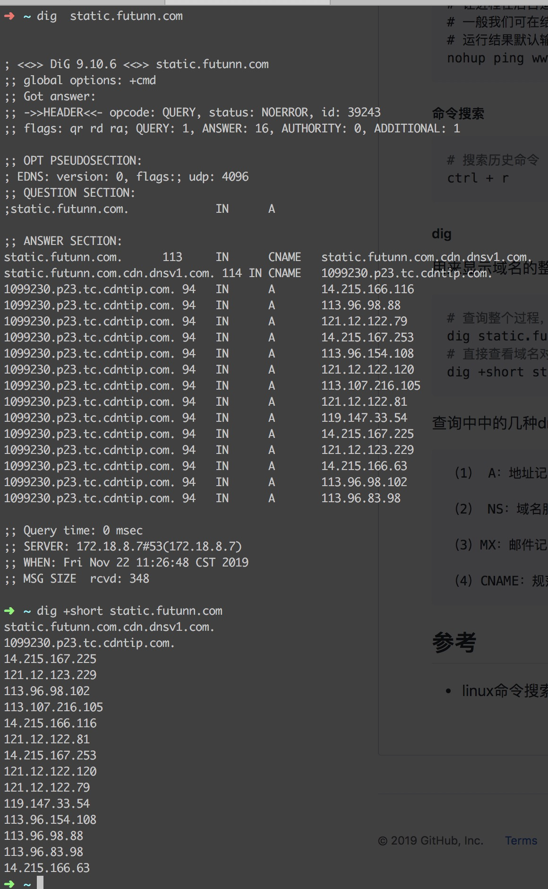
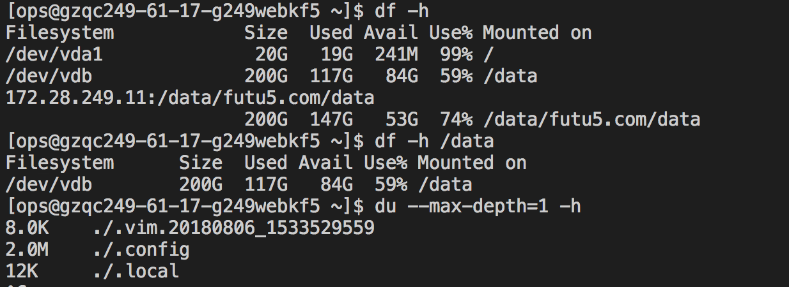
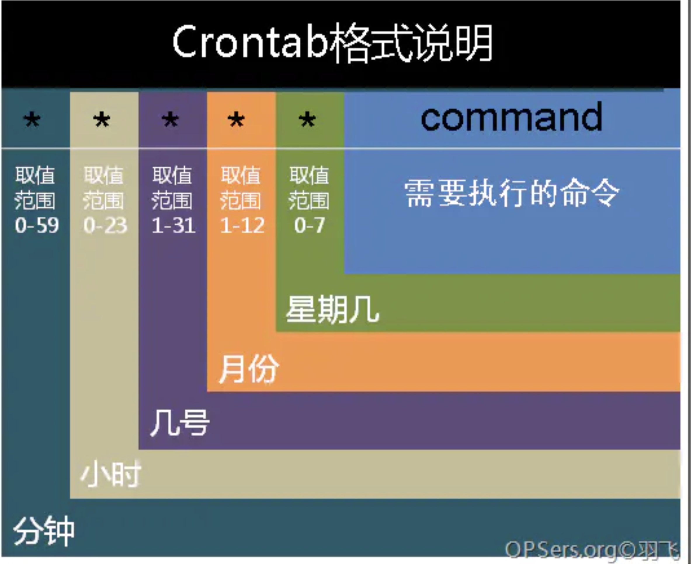

#### 常用命令
小白，还是多记记吧

##### grep
- 使用正则表达式搜索文本，并把匹 配的行打印出来
- 比较好的教程:<http://www.cnblogs.com/peida/archive/2012/12/17/2821195.html>
- 要记住的命令
```html
# 在php -i的输出中搜索php.ini，可以用来查找php的位置
php -i | grep php.ini

# 在多个文本中搜索文本
grep '笔记' CSS3原生变量var.md cssworld学习笔记.md

# 在特定的文件中搜索并列出文件名
grep passport -rl *.conf
# -E使用扩展的正则来search，见这里https://www.cnblogs.com/cwy-blog/p/8005974.html
grep -Ei  'passport|baidu'  -rn *.conf

# 根据关键字搜索进程（如搜索sublime）
ps aux | grep Sublime

# 列出关键词在文件中的行数
grep -n  log passport.conf
# 同时忽略大小写
grep -ni  log passport.conf


```

##### alias
```sh
# 累出某个具体的alias的具体命令
alias sql
```

##### tail head
```html
# 实时输出a.log的 结尾 10行信息
tail -f -n 10  a.log
# 输出a.log的 开头 10行信息
head -n 10  a.log
```

##### pbcopy
```html
# 将一段文本复制到系统剪贴板
# mac: 将输出通过 | pbcopy 即可输出到系统剪贴板
cat .bash_profile | pbcopy
echo 'hello' | pbcopy
# 将某个文件的内容复制到系统剪贴板
pbcopy < .bash_profile
```

##### ps
- ps命令列出的是当前那些进程的快照，就是执行ps命令的那个时刻的那些进程
- 如果想要动态的显示进程信息，就可以使用top命令
- 要记住的命令
```
# 列出目前所有的正在内存当中的程序
ps aux

# 查看nginx的配置文件目录
ps aux | grep nginx
# 查看配置文件是否有效
nginx -t
```

##### lsof

```
# 列出当前的端口占用情况
# node上可能会存在后端占用了某个端口，但是控制台退出了，进程未消亡，再次开发node应用程序的时候，会提示端口被占用：Error: listen EADDRINUSE :::4000
#（port替换成端口号，比如6379）可以查看该端口被什么程序占用
sudo lsof -i tcp:port
sudo lsof -i :port
```

##### kill，pkill
杀掉进程
```
# 根据pid来结束某个进程，-9表示无条件终止进程
sudo kill -9 某个pid
# 根据应用程序的名称杀掉进程
pkill httpd
```

##### nohup
```
# nohup some_command &
# 让进程在后台运行，即便控制台关闭也不受影响
# 一般我们可在结尾加上"&"来将命令同时放入后台运行
# 运行结果默认输出在单前目录 的`nohup.out'文件中
nohup ping www.ibm.com &
```

##### 命令搜索

```sh
# 搜索历史命令
ctrl + r
```

##### dig

用来显示域名的整个查询过程

```sh
# 查询整个过程，包括背后的额cname
dig static.xxx.com
# 直接查看域名对应的ip
dig +short static.xxx.com

```



查询中中的几种dns记录类型

```sh
（1） A：地址记录（Address），返回域名指向的IP地址。

（2） NS：域名服务器记录（Name Server），返回保存下一级域名信息的服务器地址。该记录只能设置为域名，不能设置为IP地址。

（3）MX：邮件记录（Mail eXchange），返回接收电子邮件的服务器地址。

（4）CNAME：规范名称记录（Canonical Name），返回另一个域名，即当前查询的域名是另一个域名的跳转
```

这篇文章讲的详细<http://www.ruanyifeng.com/blog/2016/06/dns.html>

##### ssh免密码登录
- 将~/.ssh/id_rsa.pub 拷贝到 目标机器的~/.ssh/authorized_keys 文件中
- 注意pub文件的换行问题，在txt中打开再复制

##### 磁盘命令相关

```sh
# 查看磁盘的挂载情况和使用情况
df -h
# 查看某个目录的具体使用情况
df -h
# 查看当前目录每个文件夹占用的情况
du --max-depth=1 -h
# 查看某个目录下的文件夹占用情况
du --max-depth=1 -h  /usr/
```


##### ls （不记不是程序员）

```sh
# -a 表示显示所有文件：目录、文件
# -l list展示
# -h 人性化形式显示文件大小
# -T 显示文件或目录最后修改的时间
ls -alhT
# 在结果中只显示 匹配someword的文件，不包括文件目录,类似过滤
ls *someword*
```
##### crontab

- 学习资料：<https://www.jianshu.com/p/838db0269fd0>


时间格式



#### vi的一些技巧

```sh
# 粘贴复制时，格式错乱解决办法
:set paste
# 显示行号
:set nu
# 跳转到首行
gg
## 跳到整段末尾
shift+g
```

## 参考

- linux命令搜索引擎<https://wangchujiang.com/linux-command/>
